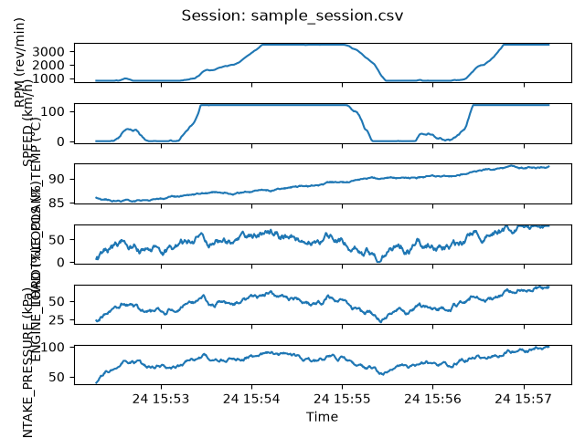

# Project: OBD-II Data Logger

## Goal
Python tool that connects to a vehicle via ELM327 adapter, polls OBD-II
PIDs at a configurable rate, logs to CSV, and visualizes time-series data.
Target use case: EV/automotive engineering portfolio project.

## Stack
- Python 3.11
- python-obd (ELM327 communication)
- pandas (data handling)
- matplotlib (visualization)
- pytest (testing)

## Structure
src/connection.py    — ELM327 connection and PID capability query
src/logger.py        — polling loop and CSV writer
src/visualizer.py    — matplotlib plots from CSV
src/config.py        — PID list, poll rate, constants
tests/               — pytest, mock the OBD connection for unit tests
data/                — sample CSV recordings (committed to repo)

## Conventions
- Type hints on all functions
- Docstrings with units (e.g., speed in km/h, temp in °C)
- All magic numbers as named constants in config.py
- No hardcoded file paths — use pathlib.Path
- Mock obd.Connection in tests — never require hardware to run tests

## Current focus
Building src/connection.py — connect to ELM327, query supported PIDs,
print a capability report

## Demo
